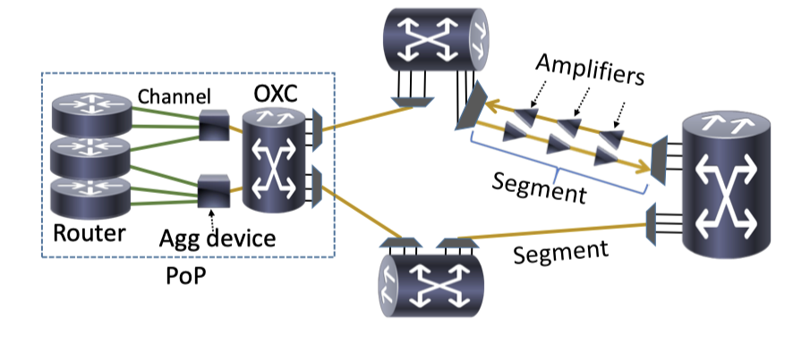
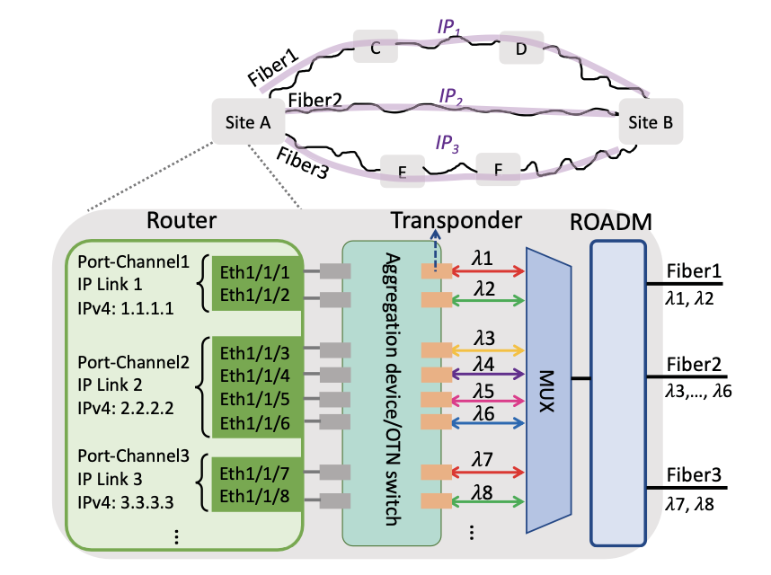

## TODO: Confirmation of Background Facts
* Title: "Understanding Transport Network Control and Management 
in the Era of **SDM** and **Multi-band**"
* Method: Telemetry + QoT model + Tomography + OTDR

### SDM和mult-band光网络系统有何特殊之处?
* SDM不等于MCF，也可以是parallel single-mode fiber (multi-rail fiber) 
<-- <em>Solving for Scalability From Multi-Band to Multi-Rail Core Networks, JLT 2022, Google</em>
* 关于MCF光纤：SRS对多波段的影响极大，在规划阶段需要使用GNpy等QoT模型进行评估
  * **问题1**：GNpy模型如何与传统线性优化求解进行匹配（普通的线性优化在大规模网络已经很难快速完成）
* 关于放大器：MCF光纤分成多个单模光纤分别放大，不同波段信号分别放大（或共用）
* 关于ROADM：(一般情况)core和band均分开放大
* SDM和mult-band光网络中器件数量会不会激增？从而导致出错概率变高？
* 或者导致telemetry需要处理数据量变得很大，以至于无法在高频率下快速处理

> 对于EDFA，谷歌使用C+L分别放大，并且使用EDFA+Raman的方法
> 
> Despite the fact that separate C and L band amplifiers slightly lower overall available transmission bandwidth, it simplifies operations as it allows to turn up bands independently as capacity grows.
> 
> Hybrid amplification schemes are widely adopted as Raman amplifiers allow to increase system SNR thanks to an improved noise figure. Therefore, Google currently deploys them in the almost every long haul route.
> 
> -- <cite>Opportunities and Challenges of C+L Transmission Systems, 
JLT 2020, Google</cite>

### 对于光纤切断事件，是否可以预警？

* 光纤在折断过程中可能有非常强的弯曲过程，但从发生可探测的弯折（异常损耗）
到光纤彻底断开的时间是多少？提前时间的概率分布
* Q-factor Drop事件与outage有强关联，可以作为预警
（Q-factor下降之后还会自己恢复嘛）
> For example, for a window of 7 days, the probability of outage occurrence increases to 70% if there has been a Q-drop event within that week. This means Qdrop events are strong predictors of future outages.
> 
> -- <cite>Optical Layer Failures in a Large Backbone, IMC 2016, Microsoft</cite>

### 已知，关于fiber-cut：
> fiber cut发生后需要大几个小时恢复: 50% of the fiber cut events last longer than nine hours, and 10% last over a day
> 
> the duration of fiber cut events accounts for 67% of the total downtime
（Note：这里意思**不是**说67%的断路是由fiber cut造成的）
> 
> --<cite>ARROW: Restoration-Aware Traffic Engineering, sigcomm 2021, MIT & Facebook</cite>

因此需要在灾后重建完成之前，先对灾区人民进行及时的临时疏解 --> (ARROW)

IP层：traffic engineering (transponder, router)

optical层：optical path Reuse / Reconfiguration

    
    

****

### Related work
**Optical restoration**
* ARROW: Restoration-Aware Traffic Engineering, sigcomm 2021, MIT & Facebook
* TeaVaR: Striking the Right Utilization-Availability Balance in WAN Traffic Engineering, sigcomm 2019, MIT & Microsoft
* Traffic engineering with forward fault correction, sigcomm 2014, Microsoft
* FlexWAN: Software Hardware Co-design for Cost-Effective and Resilient Optical Backbones, sigcomm 2023, Tencent (部分内容)
* A Social Network Under Social Distancing: Risk-Driven Backbone Management During COVID-19 and Beyond. NSDI 2021, Facebook (部分内容)

**Network telemetry**
* Detecting Ephemeral Optical Events with OpTel, NSDI 2022, Tencent
* Evolvable Network Telemetry at Facebook, NSDI 2022, Facebook

**Optical network reconfiguration**
* CHISEL: An optical slice of the wide-area network, NSDI 2024, Microsoft
* Cost-effective capacity provisioning in wide area networks with SHOOFLY, sigcomm 2021, Microsoft

**Solver acceleration**
> The performance decline during transient link failures can be compensated through rapid recomputation.
> ... can be used to react quickly to demand changes and link failures.
* Teal: Learning-accelerated optimization of wan traffic engineering, sigcomm 2023
* Contracting Wide-area Network Topologies to Solve Flow Problems Quickly, NSDI 2021

**Multi-band & SDM optical network**
* Solving for Scalability From Multi-Band to Multi-Rail Core Networks, JLT 2022, Google
* Provisioning in Multi-Band Optical Networks, JIT 2020

**Optical failure localization and prediction**
* 
