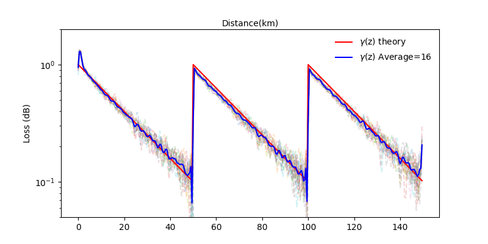

# OptTomo

<div style="text-align: center;">
    
</div>

* run ./main_multiprocess.sh to concurrently call tomo_fiber.py with different random seeds.
* ./tomo_fiber.py solve the Linear Least Squares Estimation of longitudinal power profile based on the simulation data
provided by [OpticCommPy](https://github.com/edsonportosilva/OptiCommPy).
* set the parameters related to the transmitter in ./signal_generator_coherent.py
* set the parameters related to fiber and tomography in ./tomo_fiber.py.

### Requirements

If you use the Pycharm virtual environment (else pass) :

```
source .venv/bin/activate
```

Install Dependencies from ./requirements.txt

```
pip install -r requirements.txt
```

### TODO
1. Reproducing the results published by NTT (perfect receiver, regardless of DSP algorithms). :heavy_check_mark:
2. Introducing Error and corresponding DSP calibration algorithms.
3. Algorithm optimization and speeding up with GPU.
4. Integrating the tomography approach with the [GNpy](https://github.com/Telecominfraproject/oopt-gnpy) library.
5. Expanding our model, e.g., to the scenario considering polarization multiplexing, space division multiplexing, or SRS.

### Computational Overhead
*  $\gamma^{'} = Re[G^{H}G]^{-1}Re[G^{H}A_{1}]$
*  $G$ is a $T_{s} \times Z$ matrix, and $A_{1}$ is a $T_{s} \times 1$ vector,
 where $T_{s}$ is the number of samples of signal ($\approx 10^4, 10^5$), and $Z$ is the number of the monitoring positions along the fiber ($\approx 10^3$).
* For the scenario with a pilot signal, the major burden of computation can be performed
in advance: $G$ and $K=Re[G^{H}G]^{-1}$ is fixed.
* The computation, which needs to be performed in real time, consists of two steps:
> **STEP 1**: $A_{1}[L]=A[L]-A_{0}[L]=A-\hat{D_{0L}}A[0]$, $\hat{D_{0L}}$ involving FFT,IFFT and element-wise multiplication --> $O(T_{s}\log T_{s})$
* Given $A_{1} = A_{1,re} + i A_{1,im}$ and $G^{H} = G_{re}^{H} + i G_{im}^{H}$, the results $\gamma^{'} = K Re[G^{H} A_{1}] = [K G_{re}^{H}] A_{1,re} - [K G_{im}^{H}] A_{1,im}$
> **STEP 2**: $\gamma^{'} = W_{re}A_{1,re} - W_{im}A_{1,im}$ --> matrix vector multiplication with $Z \times T_{s}$
and $T_{s} \times 1 =  4 \times Z \times T_{s} \approx 10^8$ FLOP and $\approx$ 800MB memory for storage the precomputed matrix $W_{re}, W_{im} = [K G_{re}^{H}], [K G_{im}^{H}]$ (in FP32)
* GTX 4060: (FP32)15TFLOPS, (GDDR6)8GB, Memory Bandwidth 272GB/s 
--> Execution time: sub-second (theory)
* Tested on Apple M1 ARM-based system-on-a-chip (1024 ALU, 2.6TFLOPS in FP32): $\approx$ 100ms
